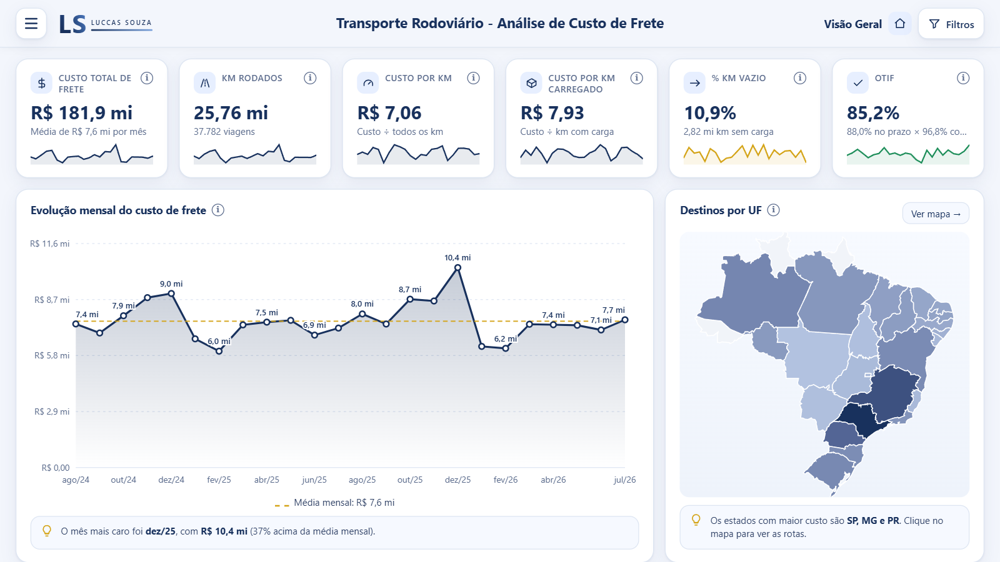
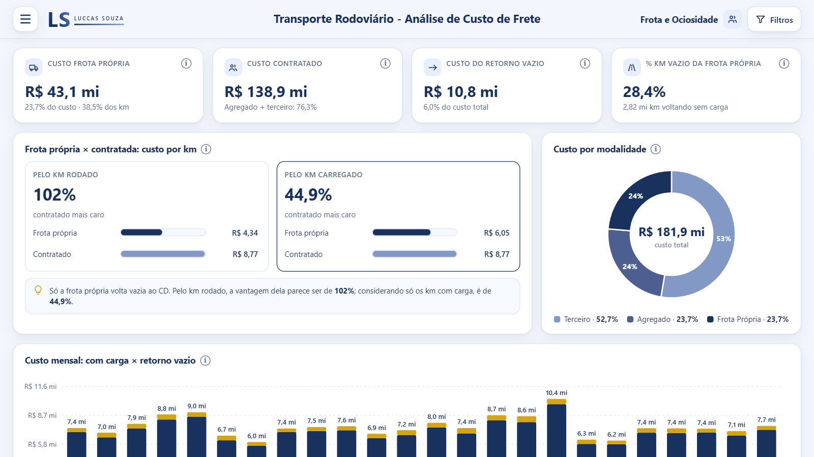
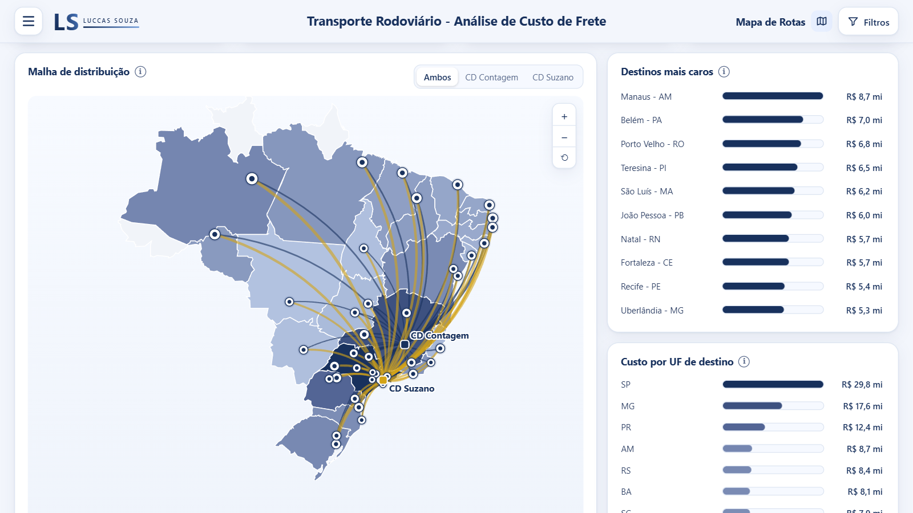

# Transporte Rodoviário: Análise de Custo de Frete

**Autor:** Luccas Souza | Analista de Dados | **Data:** 26/09/2026

🔗 **[Acessar o dashboard publicado](https://app.powerbi.com/view?r=eyJrIjoiYzRkMjkxMDAtMzQyNy00MTI2LThjMmItNGNlMzI1ZWRjZjM3IiwidCI6IjgxY2I0YzMxLWRiOTUtNDcxNC1hYzhjLTRkMzAwNmVjZjRiMCJ9)**



## 1. Visão geral do negócio

**O problema.** Toda operação de transporte acompanha o custo por quilômetro, e esse número costuma
favorecer a frota própria mais do que deveria. Dividindo o custo dela por todo quilômetro rodado, o
resultado é R$ 4,34/km contra R$ 8,77/km do frete contratado, uma diferença de 102%. Só que o
caminhão próprio precisa voltar ao CD, e volta vazio. Quem decide entre comprar caminhão e contratar
frete com esse número superestima a vantagem da frota própria em cerca de duas vezes.

**O objetivo deste projeto** foi responder às perguntas que vêm depois do R$/km: quanto custa o
frete e onde está o dinheiro, qual trecho puxa o custo, com que tipo de veículo se está gastando,
se compensa ter frota própria ou contratar (e quanto se perde rodando vazio) e qual nível de serviço
esse gasto entregou. Cada pergunta ocupa uma página, na ordem em que a análise costuma andar.

**Usuário final.** O dashboard atende dois perfis:

- O gestor de transporte ou de compras de frete, que precisa de um custo comparável entre
  modalidades para negociar contrato, dimensionar frota e defender orçamento. Ele também precisa
  acompanhar o frete contratado abaixo do piso mínimo da ANTT, que é risco regulatório.
- O analista, que cruza período, CD de origem, região, UF, cidade, rota, modalidade de frota, tipo
  de veículo e status de entrega, com as mesmas definições de métrica em qualquer combinação.

> ⚠️ **Nota de transparência:** os dados são inteiramente sintéticos, gerados por script Python
> com semente fixa (seed 42). Os parâmetros foram calibrados com referências públicas do setor
> (coeficientes de piso mínimo da ANTT, preço do diesel S10 da ANP, consumo por configuração de
> eixos, Pesquisa CNT de Rodovias) para produzir ordens de grandeza plausíveis, mas não derivam de
> dados de nenhuma empresa. Os números deste documento demonstram método analítico e não servem de
> benchmark de mercado.

**Escopo.** São 37.782 pernas de viagem entre agosto de 2024 e julho de 2026 (24 meses), com 88
veículos em três modalidades (frota própria, agregado e terceiro) e 83 rotas que saem de dois centros
de distribuição, Suzano-SP e Contagem-MG, para 42 cidades em 24 UFs. O custo total no período é de
R$ 181,9 milhões.

## 2. Racional analítico

Esta seção explica por que cada indicador está no dashboard e qual decisão ele apoia.

### O grão é a perna de viagem

Cada linha do fato é uma perna: um CT-e carregado ou um retorno vazio da frota própria. Com o grão
"1 linha = 1 entrega", o retorno vazio sairia da base junto com o custo que ele gera, e não haveria
como medir ociosidade nem corrigir a comparação entre modalidades.

### Uma métrica única de custo para naturezas contábeis diferentes

A frota própria gera custo por componente (diesel, pedágio, manutenção, motorista e custo fixo
rateado). Agregado e terceiro geram um valor de frete contratado. Pela regra de negócio, as duas
colunas nunca aparecem juntas na mesma perna. O `custo_total` é calculado na carga (o frete
contratado quando existe, senão a soma dos componentes) e é a única métrica de custo do dashboard,
o que coloca as três modalidades na mesma escala.

### Custo por km carregado no lugar do custo por km rodado

Este denominador desconta o quilômetro em que o caminhão não levava carga:

```dax
Custo KM Carregado Própria =
DIVIDE (
    [Custo Frota Própria],
    CALCULATE ( [KM Carregado], D_Veiculo[modalidade_frota] = "Frota Própria" )
)
```

```dax
Gap Contratado vs Própria =
DIVIDE ( [Custo KM Carregado Contratado], [Custo KM Carregado Própria] ) - 1
```

A frota própria roda 38,5% dos quilômetros, e 28,4% dos quilômetros dela são de volta sem carga.
Com o denominador corrigido, o custo dela sobe de R$ 4,34 para R$ 6,05 por km carregado, contra
R$ 8,77 do contratado. A vantagem cai de 102% para 44,9%, menos da metade do que a conta pelo km
rodado indica. Uma decisão de investimento em frota deve partir do valor corrigido.



### Quanto custa rodar vazio

O retorno vazio custou R$ 10,8 milhões no período, 6,0% do gasto total. A ociosidade cresce com a
distância e com a falta de carga de volta: o percentual de km vazio vai de 9,1% nos destinos do
Sudeste a 13,4% no Norte. Nas rotas longas, esse número ajuda a negociar carga de retorno antes de
discutir preço de frete.

### OTIF multiplicativo

```dax
OTIF = [% No Prazo (OTD)] * [% In Full]
```

O OTIF mede a entrega que chegou no prazo e completa, sem avaria nem devolução. A média das duas
taxas daria 92,4% e contaria como sucesso uma entrega que falhou em um dos critérios. O produto
(88,0% × 96,8% = 85,2%) é a proporção que passou nos dois. O denominador exclui as viagens ainda em
trânsito e os retornos vazios, que não têm entrega a avaliar.

### Frete abaixo do piso ANTT

Dos 22.139 CT-e contratados, 3.753 (17,0%) foram fechados abaixo do piso mínimo de referência. Na
média, a carteira paga 13,3% acima do piso, e por isso a média não serve aqui: ela esconde uma
parcela relevante de documentos que expõem a empresa a autuação. O indicador conta CT-e em vez de
reais porque o risco existe por documento emitido.

### Onde está o dinheiro e onde ele rende menos

Sudeste (32,3%) e Nordeste (29,0%) somam 61% do custo. No Sudeste o peso vem do volume de viagens
curtas; no Nordeste, da distância. As duas regiões têm contas de tamanho parecido e pedem ações
diferentes. A distribuição por rota tem cauda longa: as cinco maiores, todas de longa distância a
partir de Suzano, concentram 14,6% do custo, com Suzano → Manaus à frente (R$ 6,8 milhões).

Por tipo de veículo, o que mais pesa no orçamento está entre os menos eficientes por km carregado:

| Tipo de veículo | Participação no custo | R$ por km carregado |
|---|---|---|
| Toco | 4,6% | 5,17 |
| Truck | 12,1% | 6,12 |
| Carreta LS | 23,6% | 8,19 |
| Carreta 3 eixos | **36,6%** | **8,81** |
| Rodotrem | 5,1% | 11,37 |

A Carreta 3 eixos responde por mais de um terço do custo a R$ 8,81 por km carregado, por isso é a
primeira candidata a revisão de contrato.



## 3. Decisões de design/UX

As decisões abaixo existem para reduzir o esforço de leitura ou evitar uma conclusão errada.

- Cada KPI e cada título de gráfico tem um ícone de informação que explica o indicador, como ele é
  calculado e dá um exemplo. OTIF, In Full, km carregado e retorno vazio não fazem parte do
  vocabulário de quem aprova orçamento.
- O filtro fica num painel suspenso, com nove dimensões que se combinam e valem para todas as
  páginas. A aplicação é imediata, sem botão "aplicar". Os filtros ativos aparecem como etiquetas
  removíveis no topo da página e num contador no botão, porque um filtro esquecido é a causa mais
  comum de leitura errada de um dashboard.
- No filtro de veículo, cada tipo aparece desenhado com a configuração de eixos e a capacidade.
  Nem todo leitor distingue Bitrem de Rodotrem pelo nome, mas a silhueta com 7 e 9 eixos dispensa
  legenda.
- Os gráficos são desenhados no tamanho real do cartão, e as listas se distribuem na altura
  disponível e ganham rolagem quando crescem. Um cartão com espaço vazio sugere dado faltando.
- Os KPIs têm estrutura e altura iguais, com rótulo, valor, contexto e minigráfico de tendência
  sempre na mesma posição, para que a comparação entre cartões seja visual.
- Todas as séries têm rótulo de dado, abreviado e com densidade adaptativa. Quando não cabem
  todos, ficam o primeiro, o último, os extremos e os intermediários alternados. As linhas de
  referência (média e meta) vão para a legenda para não disputar espaço com os valores.
- O mapa desenha arcos a partir de cada CD. A pergunta "qual trecho puxa o custo" é geográfica, e
  uma tabela de 83 rotas não deixa ver que o custo se concentra no eixo Suzano → Norte/Nordeste.
- O modo noturno tem paleta própria para gráficos, mapa e ilustrações.
- Página, filtros e tema continuam iguais quando o Power BI atualiza o visual, para que uma
  interação não devolva o leitor ao ponto de partida.

## 4. Arquitetura e stack

- **Power BI Desktop / Power BI Service**: modelagem, publicação e distribuição.
- **Power Query (M)**: ingestão e limpeza de três arquivos CSV (um fato de 37.970 × 26 e duas
  dimensões). As decisões vieram da inspeção do dado:
  - Foram removidas 151 pernas reemitidas pelo sistema de origem e 37 com distância inválida, já
    que sem distância não existe custo por km.
  - Os 56 pesos impossíveis foram anulados e as viagens foram mantidas. O custo e a quilometragem
    delas são válidos, e excluir a linha por causa de uma coluna auxiliar distorceria o custo total.
  - A mesma placa aparecia em 176 grafias (com hífen, em minúsculas, com espaço no fim) para 88
    veículos. A padronização nos dois lados do relacionamento zerou os registros órfãos.
  - O tipo de carga tinha 10 grafias para 7 categorias reais.
  - O fato usa o padrão brasileiro (vírgula decimal) e o cadastro de veículos usa o invariante
    (ponto). A tipagem automática leu o consumo de 2,5 km/l como 25 sem acusar erro, e por isso a
    cultura de conversão é declarada em cada arquivo.
- **Modelo em star schema**: um fato de pernas de viagem (37.782 linhas e 31 colunas, contando as
  derivadas) ligado a três dimensões (veículo, rota e calendário), com relacionamentos N:1 de
  direção única. A distância de referência da dimensão de rota foi renomeada na carga para não ter
  o mesmo nome da distância rodada do fato, o que levaria o Power BI a criar um relacionamento
  espúrio por autodetecção.
- **DAX**: 35 medidas de negócio em quatro grupos (KPIs, frota e ociosidade, nível de serviço,
  compliance e eficiência), além das medidas da camada de apresentação. Algumas decisões desta
  camada:
  - Na abertura por tipo de viagem, o filtro do km carregado é aplicado de forma aditiva. Se ele
    sobrescrevesse o contexto, a linha "retorno vazio" mostraria o km carregado total.
  - A ocorrência sem registro chega do CSV como texto vazio e não como nulo. A contagem por "não em
    branco" devolvia 37.782 ocorrências em vez de 2.324.
  - Todo o HTML fica em medida. Uma coluna trunca o texto em 32.766 caracteres na carga, e a camada
    de apresentação passa de 500 mil.
  - O texto é sanitizado na serialização por causa do próprio dado: duas rotas terminam em "Santa
    Bárbara d'Oeste", e o apóstrofo fecharia o literal no lugar errado sem nenhum erro no DAX.
  - Os dados vão para o visual num único cubo agregado no grão mês × rota × veículo e modalidade ×
    status (18.653 linhas), o menor grão que permite combinar os nove filtros. A interação roda no
    navegador, sem nova consulta ao modelo.
- **Python (pandas, numpy)**: geração do dataset sintético com semente fixa, o que torna todos os
  números deste documento reproduzíveis.
- **HTML, CSS e JavaScript**: camada de apresentação servida por um visual customizado, com o mapa
  em SVG construído a partir da malha territorial do IBGE.

> **Sobre a escolha da camada visual:** a interface foi construída como aplicação HTML/CSS/JS num
> único visual, sem visuais nativos. Para uma peça de portfólio, essa escolha mostra domínio do
> modelo semântico e da apresentação de ponta a ponta. Em ambiente corporativo, com governança,
> certificação de visuais e um time que mantém o artefato depois que o autor sai do projeto, o
> padrão seriam os visuais nativos do Power BI, pelo custo de manutenção.

## Contato

- 📧 luccasnsouza1@gmail.com
- 🔗 [linkedin.com/in/luccas-souza7](https://www.linkedin.com/in/luccas-souza7/)
- 💻 [github.com/luccas-souza7](https://github.com/luccas-souza7)
- 📱 [+55 11 93201-8859](https://wa.me/5511932018859)
